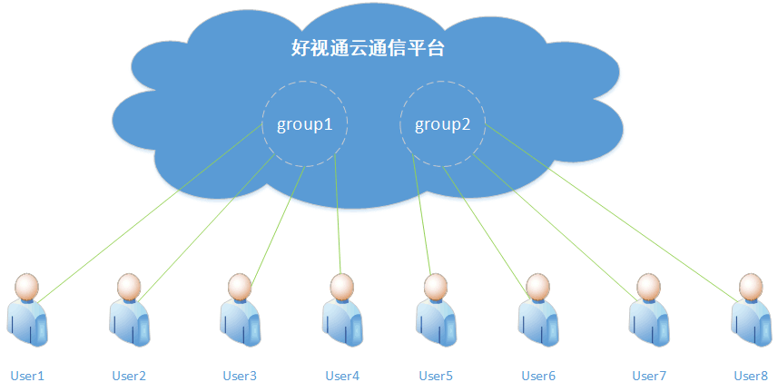

# 基本概念
阅读本文了解平台的基本概念。

## 账号认证
刚注册的账号属于未认证账号，自动获得一定额度的测试费用。要想获得更高额度的赠送费用， 可以根据情况选择认证为“个人开发者”或“企业开发者”。认证为个人开发者，需要提供身份信息；认证为企业开发者，需要提供营业执照信息。 另外，已经认证为个人开发者可以申请升级为企业开发者。

## App ID和App Secret
应用（App）是客户使用平台产品的桥梁和载体，在使用平台产品之前，必须先创建应用。系统会为每个应用分配App ID和创建App Secret， App ID用来唯一标识一个应用；App Secret作为加密秘钥，用来登录鉴权。App Secret对于客户的账号安全非常重要，请务必妥善保管。

## Group ID和User ID
分组（Group）是一个非常重要的概念，平台当前提供的音视频服务是基于分组的服务，在使用音视频服务之前，必须要先加入分组，只有加入到同一个分组的用户才能够进行通信。在加入分组时，用户填入分组ID（Group ID），分组ID由开发者定义。分组ID只需要在应用范围内保持唯一即可，不同应用的分组ID重复不会相互影响。

用户ID（User ID）在登录时，此字段必填，开发者必须保证应用下User ID是唯一的。此字段提供给开发者用来关联业务数据，比如，如果想知道应用中某个用户的计费情况，则可以将用户ID传入，平台会将此用户ID与音视频流关联起来，在导出的计费记录中会带上用户ID。

## Video ID
Video ID用来标识一个虚拟的视频源，Video ID由开发者定义，但需要保证同一个User ID下同一时刻Video ID的唯一性。同一用户可以广播多路视频，不同视频通过Video ID区分。