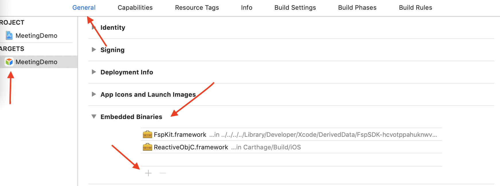
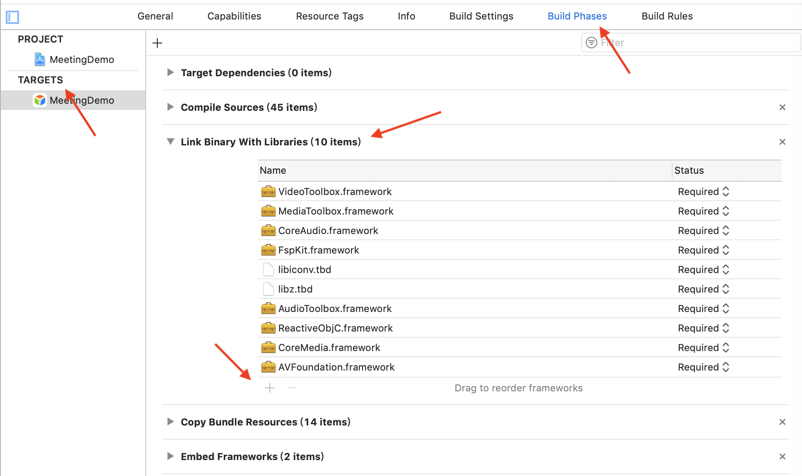

# 集成客户端
本文如何集成iOS SDK, 需要准备的开发环境，包含前提条件及SDK集成方法等内容。

## 前提条件
请确保满足以下开发环境要求:

- Xcode 10.0+
- iOS 8.0+ 真机(iPhone 或 iPad)
- 请确保您的项目已设置有效的开发者签名

## 创建项目并获取 App ID

1. [点此注册](http://customer.paas.hst.com/register)，按照步骤注册账号，创建应用。
2. 配置使用相关产品并上线应用。
3. 点击 **应用** 下的**应用列表** ，在详情页面获取到 **App ID**。

## 添加SDK
1. 下载[iOS SDK](http://paas.hst.com/developer/downloadSDK)，解压并打开。

2. 使用 Xcode 打开你想要运行的项目，然后选中当前 Target。
3. General 页签,展开Embedded Binaries项,点击+图标添加FspKit.framework

4. Build Phases 页签，展开 Link Binary with Libraries 项并添加如下库。点击 + 图标开始添加

+ VideoToolbox.framework
+ MediaToolbox.framework
+ CoreAudio.framework
+ AudioToolbox.framework
+ CoreMedia.framework
+ AVFoundation.framework
+ libiconv.tbd
+ libz.tbd
+ libc++.tbd

现在您已经设置好了Xcode开发环境，可以开始使用iOS SDK了！

> 目前所有产品的接口在一个SDK内提供,集成后,可以开始所有产品的功能开发。

## 相关文档
完成客户端集成后，你可以使用SDK,使用各个产品的功能:

- [准备工作](../prepare_ios.md)
