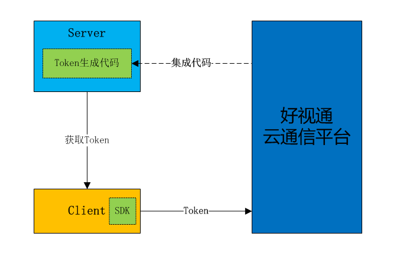

# 应用鉴权
鉴权是判断访问者是否具有合法身份，保障客户账号安全性的必要措施之一。开发者在使用SDK进行登录时，需要携带Token，系统会对Token携带的信息进行校验，如果信息正确则登录成功，否则登录失败。

## 生成token
Token在开发者这一侧通过代码生成，通过[Token生成代码](http://paas.hst.com/developer/downloadToken)选择对应语言的Token生成代码，开发者需要将此代码集成到自己的服务器中，控制Token的生成和分发。由于Token会使用App Secret进行加密，开发者需要确保App Secret的安全性。考虑到App Secret泄漏的风险，如无特殊情况，不建议将Token生成代码集成到客户端。